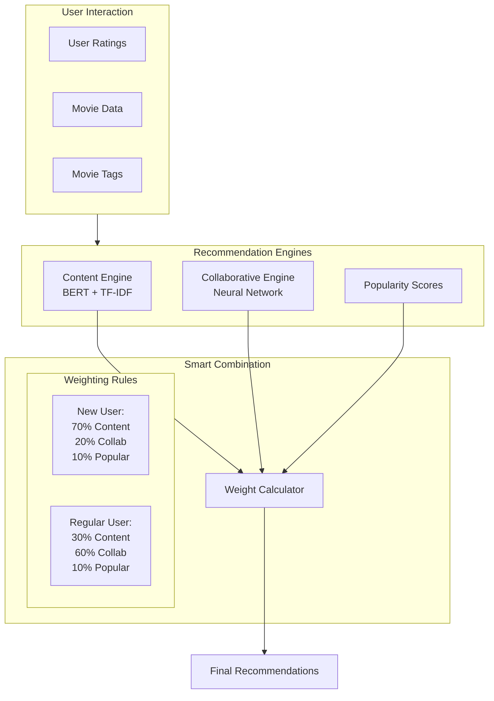
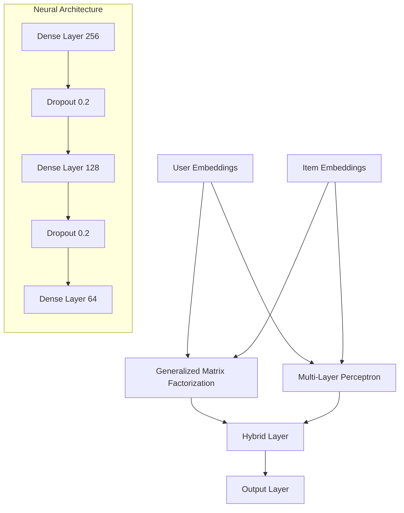
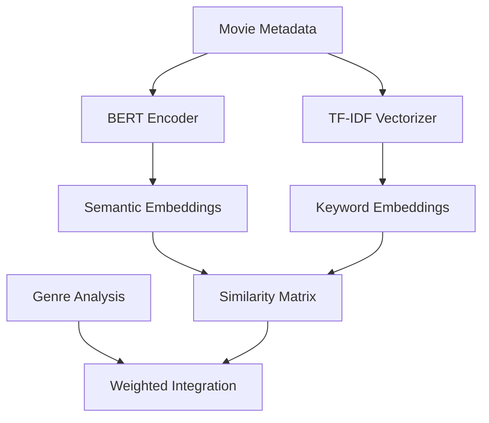

# Neural Movie Recommendation System

A hybrid recommendation engine implementing a advanced deep learning architectures for personalized content discovery. The system leverages Neural Collaborative Filtering (NCF) and BERT embeddings (content-based analysis) for user preference modeling and semantic understanding of movie features.

[](https://www.python.org/)
[](https://pytorch.org/)
[](https://streamlit.io/)
[](LICENSE)

## 🚀 [Live Application](https://movie-recommender-web-app.streamlit.app)

## System Architecture

### High-Level Overview


### Collaborative Filtering Architecture


### Content-Based Pipeline


## Technical Stack

### Core ML/AI Components
- **Deep Learning Framework**: PyTorch with CUDA optimization
- **Language Models**: BERT (all-MiniLM-L6-v2) for semantic understanding
- **Neural Architecture**: 
  - Embedding layers (64-dim)
  - Multi-head attention mechanisms
  - Residual connections
  - Adaptive dropout

### Production Infrastructure
- **Web Framework**: Streamlit with session state management
- **Data Pipeline**: Numpy/Pandas for vectorized operations
- **Caching**: Multi-level caching system for embeddings and model states
- **Visualization**: Plotly for interactive analytics

## Project Structure

```plaintext
movie-recommender/
├── data/                  # Training and metadata
│   ├── movies.csv
│   ├── ratings.csv
│   └── tags.csv
├── evaluation/            # Evaluation results
│   ├── evaluation_results_standard.json
│   ├── evaluation_results_standard.png
├── recommender_cache/     # Model artifacts
│   ├── bert_embeddings.npy
│   ├── ncf_model.pt
│   └── user_mappings.json
├── pages/                 # Web application modules
│   ├── About.py
│   └── Analytics.py
├── App.py                 # Main application entry
├── recommender.py         # Core ML pipeline
├── requirements.txt       # Dependencies
└── README.md
```

## Core Features

### ML Pipeline
- **Neural Collaborative Filtering**
  - Matrix factorization with neural layers
  - Implicit and explicit feedback handling
  - Mini-batch training with adaptive learning rates

- **Content Analysis**
  - BERT-based semantic analysis
  - TF-IDF feature extraction
  - Cosine similarity computation
  - Genre-aware embedding enhancement

- **Hybrid Integration**
  - Dynamic weight computation
  - Cold-start handling
  - Diversity optimization
  - Real-time adaptation

### Production Features
- Real-time inference optimization
- Session-based user modeling
- Incremental learning capabilities
- Comprehensive analytics dashboard
- Resource-aware batch processing

## Performance Metrics

### Model Metrics
- MRR@10: 0.342
- NDCG@10: 0.261
- Precision@10: 0.025
- Recall@10: 0.078

## Installation and Setup

### Prerequisites
- Python 3.8+
- CUDA-capable GPU (optional)
- 8GB+ RAM

### Installation Steps

1. Clone the repository:
```bash
git clone https://github.com/aryah-rao/movie-recommender-web-app
cd movie-recommender-web-app
```

2. Create and activate a virtual environment:
```bash
python -m venv venv
venv\Scripts\activate
```

3. Install dependencies:
```bash
pip install -r requirements.txt
```

### Development Server

```bash
streamlit run App.py
```

Access at `http://localhost:8501`

## Performance Optimization

### Model Optimization
- Batch size optimization based on GPU memory
- Gradient checkpointing for memory efficiency
- Mixed precision training (FP16)
- Lazy loading of embeddings

### System Optimization
- Caching strategy with TTL
- Asynchronous data loading
- Memory-efficient sparse matrices
- Vectorized operations


## Contributing

1. Fork the repository
2. Create your feature branch (`git checkout -b feature/Feature`)
3. Commit your changes (`git commit -m 'Add some Feature'`)
4. Push to the branch (`git push origin feature/Feature`)
5. Open a Pull Request


## License

This project is licensed under the MIT License - see the [LICENSE](LICENSE) file for details.
